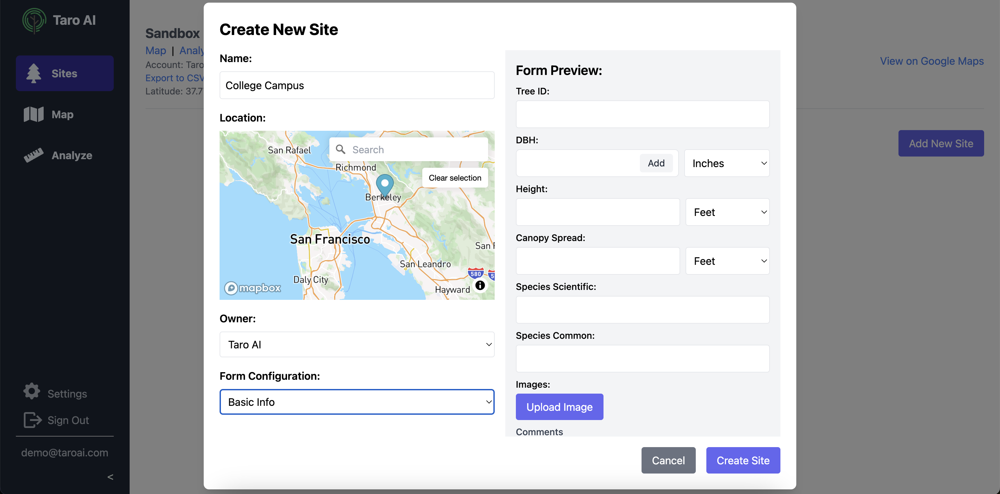
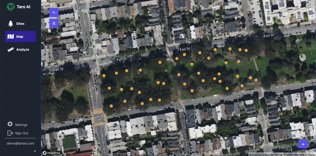
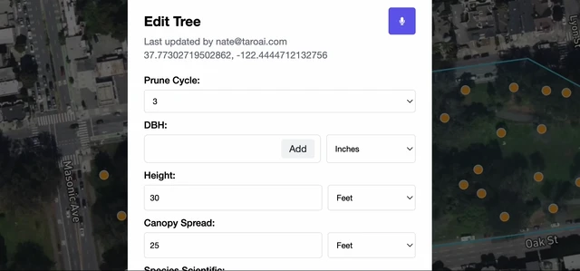
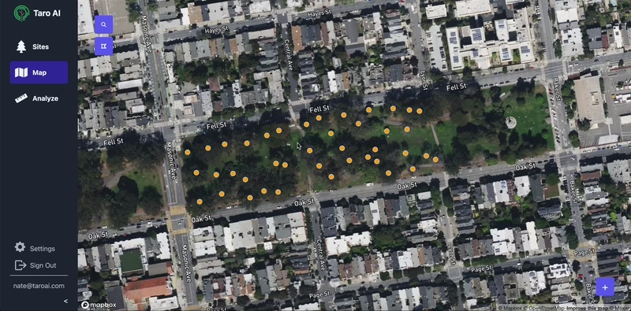
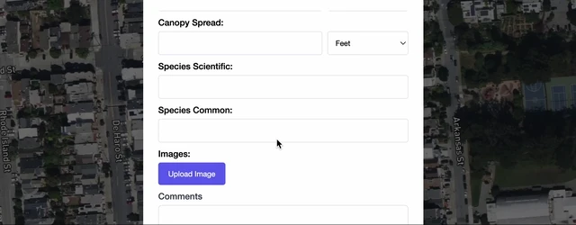

## 🍔 Self-Serve New Site Creation
We've added the option to create a new site so users can add new sites themselves from the app. A preview of the form setup for this site is shown to the right. Select from the configurations used by your organization.

    

## 🔶 Area (Polygon) Selection
By popular demand! Create and name polygon areas on the map, and export just the trees in that area.

    

## 💽 Customized Site Surveys
A bit of a behind the scenes change, but Taro AI now supports customized survey forms for each site. Want to use a different health scoring system? Want to specify how each DBH was measured? Need to add a "has bees" option for dangerous site? Pick whatever layout you want when creating a site, and if you want a layout that isn't listed we'll create a new one for you!

## 🌵 Multi-stem DBH
No more writing multi-stem information in the comments! The multi-stem DBH field accepts both single-stem and multi-stem measurements.

    

## 👯‍♀️ Duplicate Button
Ever had a bunch of similar trees in the same area? Now just hit "Duplicate" and we'll create a tree with the same information (minus the ID) for you to place on the map quickly.

    

## 📋 More Species Options
We've added even more species to our species list, and added "spp." options for non-specific scientific species.

    

