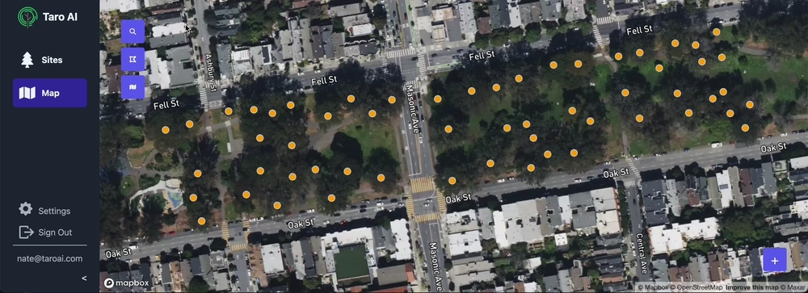
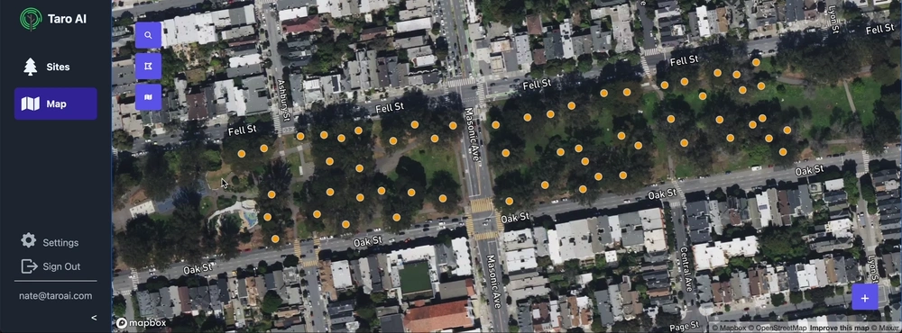

## The Map Layer Update

Displaying your data in different ways can help both on the job site and in the office. We've added a variety of map layers to help you visualize your data. The map icon in the top left corner now opens a menu where you can select both how the trees appear as well as the text that overlays them.

    

A few things you can do with this in addition to the default map layer:

* Need to make sure you took a photo of every tree before you leave the site? Use the "Missing Images" layer to show all trees that don't have an image in red.
* Need to make a map for a report showing unhealthy trees? Use the "Unhealthy Trees" layer to show all trees that are in poor health.
* Need to show the location of trees that are scheduled to be removed? Use the "Trees to Remove" layer to show all trees that are scheduled to be removed.

In addition to different map layers, you can also overlay text on each tree. Use this to display tree IDs, DBH, or any other property on the map.

    

It's also easy to create new custom map layers. Reach out to us if you'd like to request a new map layer or have ideas for new map layers!