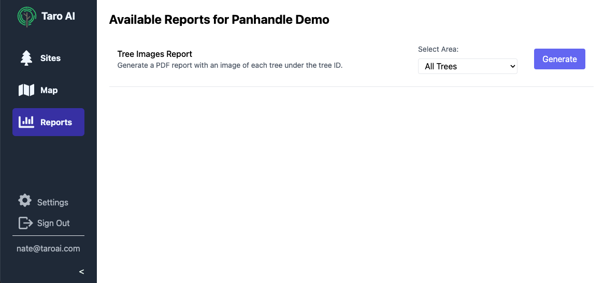
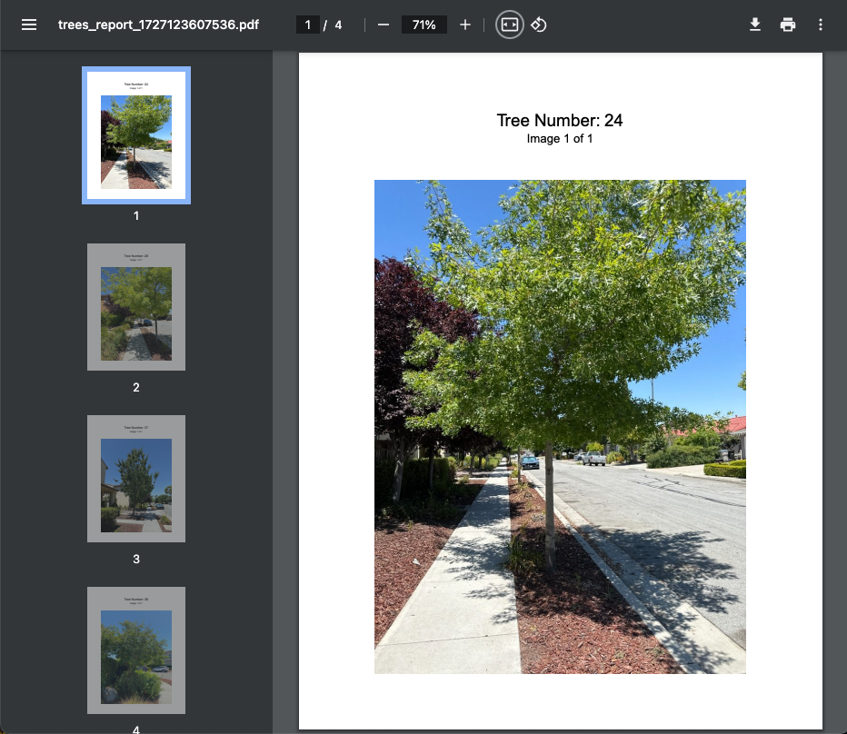

## 📊 Report Generation

Creating reports is a tedious task for many arborists. Today we're releasing our new report generation feature that will help you automatically generate reports for your clients. The first report we're rolling out is the **Tree Images Report**.

The Tree Images Report will generate a PDF with all of the images for trees in a site, and you can include the PDF in your report or as an appendix. You can include all trees, or just the trees inside a specific area. To generate a report, click the "Reports" button in the left menu and select "Generate":

    

Once finished, you'll receive an email with a link to the report. Clicking the link will open the report in a new tab.

    

We're excited to continue adding new reports to help streamline your work. Let us know if there are other reports you'd like to see!