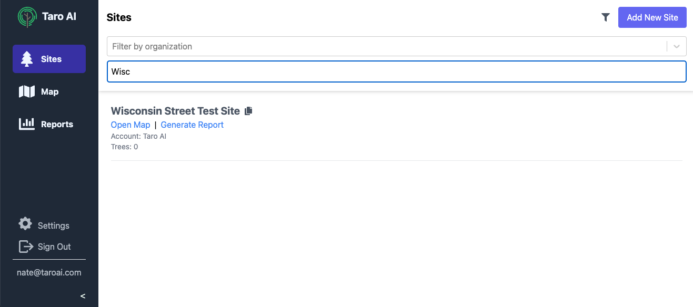
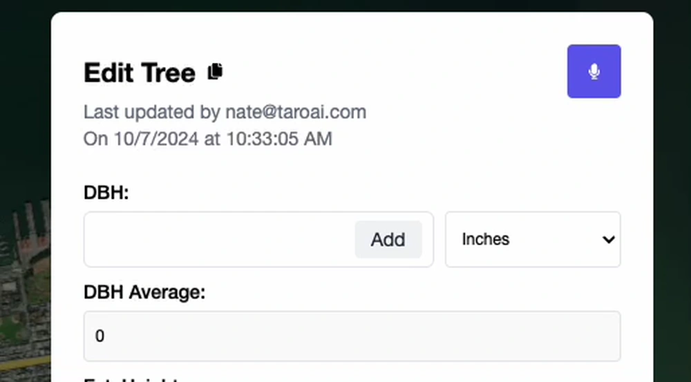

## 🌴 Re-vamped Site Page
We re-vamped the site page to make it easier to navigate and use. You can now filter sites by account or name, and we'll add other filters in the future. We also now show details about the site itself, like the number of trees present for that site.

    

## 📡 Improved Image Uploading
We've enabled multiple image uploading from the camera roll, so if you have a bunch of photos to upload you don't need to do them one by one. We also now upload your images even if you close the tree view, so you can continue working while your uploads finish.

    

## 📐 Computed Fields
Your form layouts can now include what we're calling "computed fields", which are fields that are automatically calculated based on other information about the tree. For example, you can use a custom formula to compute the DBH of a multistem tree, or you can calculate the amount of fertilizer needed based on the tree's size.

    

## 📝 Workflow Improvements
As always, we're working to make Taro easier and faster to use. We've added a number of small workflow improvements, like autofilling common species name, updating the species list with genus only options, a "snap to current location" option, and a bunch of other small improvements to be released this week.